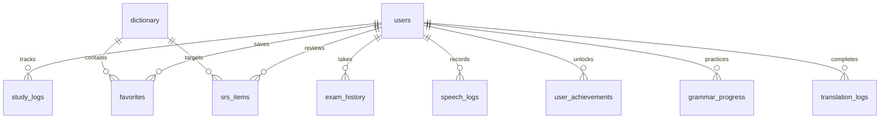

# 🀄 HánNgữ Pro - Nền Tảng Luyện Thi HSK 1 Đến HSK 9 Toàn Diện & Thông Minh

<p align="center">
  
  
  
  
  
  
  
</p>

> **HánNgữ Pro** là nền tảng học tập và luyện thi HSK từ cấp độ 1 đến cấp độ 9 chuyên sâu dành riêng cho người Việt Nam. Ứng dụng bám sát chuẩn giáo trình quốc tế **HSK 3.0 mới nhất**, tích hợp động cơ **Cơ sở dữ liệu quan hệ SQLite WebAssembly (sql.js)** chạy khép kín và lưu trữ bền vững ngay trong trình duyệt, cùng hệ sinh thái 23 phân hệ tính năng học thuật tiên tiến: Đại từ điển động, phát âm chuẩn bản ngữ Web Speech API, bộ tổng hợp tần số cao độ thanh điệu Web Audio API, thuật toán ôn tập ngắt quãng SuperMemo SM-2, hội thoại đời thực và bảng luyện viết chữ Hán Mễ Tự Cách (米字格).

---

## 📑 Mục Lục
1. [🌟 23 Phân Hệ Tính Năng Cốt Lõi](#-23-phân-hệ-tính-năng-cốt-lõi)
2. [🏗️ Ngăn Xếp Công Nghệ & Kiến Trúc Hệ Thống](#-ngăn-xếp-công-nghệ--kiến-trúc-hệ-thống)
3. [📂 Cấu Trúc Thư Mục Dự Án](#-cấu-trúc-thư-mục-dự-án)
4. [💾 Cơ Sở Dữ Liệu SQLite & Cấu Trúc Bảng](#-cơ-sở-dữ-liệu-sqlite--cấu-trúc-bảng)
5. [🚀 Hướng Dẫn Cài Đặt & Sử Dụng](#-hướng-dẫn-cài-đặt--sử-dụng)
6. [🖥️ Chế Độ Server - Client & Đồng Bộ Dữ Liệu](#-chế-độ-server---client--đồng-bộ-dữ-liệu)
7. [🔒 Bảo Mật & Quyền Riêng Tư (Local-First)](#-bảo-mật--quyền-riêng-tư-local-first)
8. [🤝 Đóng Góp & Giấy Phép](#-đóng-góp--giấy-phép)

---

## 🌟 23 Phân Hệ Tính Năng Cốt Lõi

### 1. 🔍 Đại Từ Điển Động & Quản Trị Kho Dữ Liệu SQLite (Dynamic Lexicon)
- **Tra cứu thời gian thực (Real-time SQL Search)**:
  - Tìm kiếm linh hoạt tức thì (<5ms) bằng: **Chữ Hán**, **Bính âm (Pinyin)** (có dấu hoặc không dấu), **Âm Hán-Việt** hoặc **Nghĩa tiếng Việt**.
  - Lọc theo từng cấp độ độc lập (HSK 1 đến HSK 9) hoặc toàn bộ từ điển.
- **Tự động hóa nạp & Mở rộng dữ liệu (Bulk Data Ingestion & Seeder)**:
  - **⚡ Đồng Bộ Dữ Liệu Mở Rộng**: Tự động tải và đồng bộ hàng ngàn mục từ từ kho dữ liệu JSON chuẩn HSK 3.0 vào SQLite.
  - **➕ Thêm Từ Vựng Mới Tùy Ý**: Học viên hoặc giáo viên có thể tự thêm mục từ mới (Hán tự, Pinyin, Hán-Việt, Nghĩa, Cấp độ, Bộ thủ, Số nét, Câu ví dụ và Ghi chú sư phạm). Dữ liệu được lưu vĩnh viễn vào SQLite và IndexedDB.
  - **💾 Xuất Dữ Liệu Ra JSON**: Tải về toàn bộ kho từ vựng hiện tại dưới dạng file `.json` chuẩn mực.
  - **🗑️ Xóa / Chỉnh sửa**: Quản lý từng mục từ trực tiếp từ giao diện.

### 2. 💾 Cơ Sở Dữ Liệu Quan Hệ SQLite Thực Tế (SQLite Wasm Studio & Backup)
- Tích hợp động cơ **SQLite WebAssembly (`sql.js`)** chạy trực tiếp và khép kín trên trình duyệt người dùng.
- Cấu trúc bảng quan hệ chuẩn mực:
  - `dictionary`: Bảng từ điển động có chỉ mục `idx_dict_hanzi`, `idx_dict_pinyin`, `idx_dict_level`.
  - `dialogues_library`: Thư viện kịch bản đối thoại nhập vai đời thực.
  - `users`: Thông tin học viên, cấp độ hiện tại, EXP, chuỗi ngày streak, mục tiêu HSK.
  - `error_notebook`: Sổ lỗi chẩn đoán quan hệ, đếm tần suất sai, chu kỳ ôn SRS.
  - `exam_history`: Lịch sử điểm thi thử, số câu đúng, trạng thái đạt/chưa đạt.
  - `favorites`: Danh mục từ vựng yêu thích đã lưu.
  - `study_logs`: Nhật ký hành vi học tập và điểm thưởng kinh nghiệm.
  - `srs_items`: Dữ liệu thuật toán lặp lại ngắt quãng SM-2.
  - `speech_logs`: Nhật ký luyện phát âm AI và độ chính xác ngữ âm.
  - `user_achievements`: 12 danh hiệu học thuật và trạng thái mở khóa.
  - `grammar_progress`: Tiến trình luyện ngữ pháp và câu xáo trộn.
  - `translation_logs`: Lịch sử bài tập dịch thuật Trung - Việt.
- **Tính năng Xuất & Nhập file `.sqlite` thực tế**:
  - Học viên có thể bấm **"Xuất Tệp SQLite (.sqlite)"** để tải về file database thực thụ để sao lưu hoặc mở xem bằng phần mềm **DB Browser for SQLite**.
  - Cho phép **"Nhập Tệp (.sqlite)"** để khôi phục toàn bộ tiến trình học tập từ file backup bất kỳ lúc nào.
- **SQL Query Console**: Giao diện Studio cho phép học viên hoặc giáo viên chạy các câu truy vấn SQL tùy ý (`SELECT`, `UPDATE`, `JOIN`) và xem kết quả bảng dữ liệu trực quan.

### 3. 🎴 Thẻ 3D Flashcards SRS (Active Recall)
- Hiệu ứng lật thẻ 3D xoay chiều mượt mà bằng CSS Perspective.
- Mặt trước: Chữ Hán to bản, nút phát âm bản ngữ tức thì.
- Mặt sau: Pinyin, Âm Hán-Việt, Nghĩa tiếng Việt, Bộ thủ và câu ví dụ ngữ cảnh.
- Tự động tích hợp thuật toán SRS: Bấm "Chưa thuộc" sẽ lập tức lưu vào bảng `error_notebook` của SQLite; bấm "Đã nhớ rõ" sẽ cộng điểm EXP và tăng độ thành thạo.

### 4. 💬 Hội Thoại Tình Huống Nhập Vai Thực Tế (Immersive Situational Scenarios)
- Bối cảnh thực tế sống động theo từng cấp độ:
  - **Sơ cấp HSK 1-2**: Gọi món & dặn không ăn cay tại quán ăn Tứ Xuyên.
  - **Trung cấp HSK 3-4**: Mặc cả giá sỉ & đàm phán vận chuyển tại chợ đầu mối Bạch Mã Quảng Châu.
  - **Cao cấp HSK 7-9**: Đàm phán chuyển giao công nghệ, bảo hộ sở hữu trí tuệ và ký kết thỏa thuận hợp tác song phương.
- Phát âm từng lượt thoại, phân tích câu và câu hỏi thử thách ứng biến tại chỗ.

### 5. 🌱 Khám Phá 214 Bộ Thủ Khang Hy & Chiết Tự Chữ Hán (Etymology)
- Cung cấp nguồn gốc hình thành của các bộ thủ phổ biến nhất: Nhân đứng, Khẩu, Ba chấm thủy, Tâm, Đề thủ, Thảo đầu, Ngôn, Kim,...
- Phân tích chiết tự hình thanh: Giải thích tại sao chữ được viết như vậy, các chữ Hán tiêu biểu phái sinh kèm phát âm.

### 6. 🎯 Lộ Trình 9 Cấp Độ HSK Chuẩn 3.0 (Roadmap Matrix)
- **Sơ Cấp (初级)**: HSK 1, HSK 2, HSK 3 (500 – 2.245 từ vựng).
- **Trung Cấp (中级)**: HSK 4, HSK 5, HSK 6 (3.245 – 5.456 từ vựng).
- **Cao Cấp (高级 HSK 3.0 Mới)**: HSK 7, HSK 8, HSK 9 (7.500 – 11.000+ từ vựng).

### 7. ✍️ Phòng Luyện Viết Chữ Hán Chuẩn Mễ Tự Cách (米字格 Hanzi Canvas)
- Bảng vẽ kỹ thuật số HTML5 Canvas với lưới 米字格 truyền thống.
- Chế độ **Nét mờ gợi ý (Ghost Character Guide)** hiển thị chuẩn tỷ lệ để người học đồ nét, ghi nhớ quy tắc bút thuận.
- Tích hợp bí kíp **Vĩnh Tự Bát Pháp (永字八法)**, công cụ đổi màu mực, hoàn tác (Undo), xóa bảng và phát âm trực tiếp.

### 8. 🎵 Phòng Luyện Thanh Điệu & Cặp Âm Dễ Nhầm (Tones & Minimal Pairs)
- **Mô phỏng cao độ 5 bậc (Chao's 5-level System)**: Thanh 1 (5-5), Thanh 2 (3-5), Thanh 3 (2-1-4), Thanh 4 (5-1) và Thanh nhẹ.
- **Tích hợp Web Audio API**: Phát tần số sóng âm Hertz chuẩn xác cho từng đường cong cao độ.
- **Đấu trường Cặp âm tối thiểu (Minimal Pairs)**: Phân biệt *买* vs *卖*, *问* vs *吻*, *睡觉* vs *水饺*, *知道* vs *迟到*.

### 9. ⚠️ Radar Hóa Giải Bẫy Hán-Việt (Vietnamese False Friends Radar)
- Bóc tách các từ ngộ nhận kinh điển: *方便, 东西, 勉强, 老婆, 答应, 厉害, 检讨, 耽误*.
- Bài kiểm tra trắc nghiệm phản xạ tình huống thực tế, tự động lưu vào Sổ Lỗi SQLite nếu làm sai.

### 10. 📝 Phòng Khảo Thí & Thi Thử HSK Mô Phỏng (Exam Simulation Arena)
- Đề thi thử chuẩn hóa có bộ đếm ngược thời gian thực tế.
- Đầy đủ các phần thi: Nghe hiểu (audio đối thoại), Đọc hiểu, Điền từ khuyết, Sắp xếp câu và Dịch thuật chuyên ngành HSK 7-9.
- Chấm điểm tự động và lưu lịch sử bài thi vào bảng `exam_history` trong SQLite.

### 11. 🧬 Vòng Đời Tiến Hóa Của Câu HSK (Sentence Lifecycle Engine)
- Minh họa trực quan cách một cụm từ gốc từ HSK 1 phát triển dần qua HSK 3, HSK 5 và trở thành câu văn chính luận, triết học, ngoại giao chuẩn mực ở HSK 7-9.

### 12. 📚 Kho Từ Vựng HSK 3.0 Toàn Tập (11,092 Từ Vựng Chuẩn Quốc Tế)
- **Tích hợp trọn bộ kho từ vựng HSK 3.0** từ dự án học thuật uy tín `krmanik/HSK-3.0-words-list`.
- **Cơ chế nạp dữ liệu phân khúc thông minh (Batch Chunking)**:
  - Chia nhỏ 400 mục từ mỗi transaction nạp vào SQLite Wasm nhằm đảm bảo trình duyệt luôn mượt mà 60 FPS, không gây đơ lag giao diện.
  - Hiển thị thanh tiến trình trực quan (Progress Bar) kèm % hoàn thành và số lượng từ đã đồng bộ theo thời gian thực.
- **Tùy chọn nguồn nạp kép**:
  - *Nguồn Cục Bộ (Tối ưu tốc độ)*: Tải siêu tốc từ tệp tĩnh `public/data/hsk_vocab_corpus.json` (10,943 từ đã xử lý sẵn).
  - *Nguồn Trực Tiếp GitHub Raw*: Tải dữ liệu mới nhất trực tiếp từ 7 tệp TSV của repo GitHub krmanik.
- **Tự động hóa xây dựng dữ liệu**:
  - Lệnh tiện ích `npm run fetch:hsk` chạy script Node.js tải, chuẩn hóa và tổng hợp dữ liệu bất cứ lúc nào.

### 13. 🀄 Trọn Bộ 214 Bộ Thủ Khang Hy Toàn Diện (214 Kangxi Radicals Explorer)
- Khám phá đầy đủ **214 bộ thủ Khang Hy** chuẩn ngữ pháp Hán học từ 1 nét đến 17 nét.
- Mỗi bộ thủ cung cấp đầy đủ:
  - Chữ Hán, Phiên âm Pinyin, Tên gọi Hán-Việt truyền thống, Ý nghĩa tiếng Việt.
  - Phân tích chiết tự hình thể (nguồn gốc cấu tạo chữ).
  - Danh sách chữ Hán tiêu biểu phái sinh kèm phát âm chuẩn bản ngữ.
- Bộ lọc thông minh: Lọc nhanh theo số nét (1-17 nét) hoặc tìm kiếm theo tên gọi, Hán tự, ý nghĩa.

### 14. 🧠 Động Cơ Thuật Toán Lặp Lại Ngắt Quãng SuperMemo SM-2 & Đường Cong Ebbinghaus (Spaced Repetition System)
- Triển khai **thuật toán học tập ngắt quãng SM-2 chuẩn mực**:
  - Tính toán độ dễ/khó (*Easiness Factor* - $EF$) linh hoạt theo phản xạ của học viên:
    $$EF' = EF + (0.1 - (5 - q) \times (0.08 + (5 - q) \times 0.02))$$
  - Tự động lên lịch ôn tập tối ưu theo chu kỳ ngày ($I_n = I_{n-1} \times EF$).
- **Mô hình đường cong quên lãng Hermann Ebbinghaus**:
  - Tính toán xác suất lưu giữ ký ức theo thời gian thực ($R = e^{-t / S}$).
- **4 Mức phản hồi trực quan trên Flashcards**:
  - `1 - Quên sạch (Again)`: Lặp lại ngay lập tức, đặt lại chu kỳ.
  - `2 - Khó nhớ (Hard)`: Giảm khoảng cách ôn tập, tăng tần suất.
  - `3 - Nhớ tốt (Good)`: Tăng khoảng cách ôn tập theo hệ số tiêu chuẩn.
  - `4 - Rất dễ (Easy)`: Kéo dài khoảng cách ôn tập, tối ưu thời gian.
- Dữ liệu lưu trữ độc lập vào bảng quan hệ `srs_items` trong SQLite.

### 15. 🎙️ Phòng Thí Nghiệm Luyện Phát Âm Trí Tuệ Nhân Tạo (AI Speech Lab & Pronunciation Scoring)
- Tích hợp **Web Speech API (`SpeechRecognition`)** hỗ trợ nhận dạng giọng nói tiếng Trung chuẩn (`zh-CN`).
- **Thuật toán chấm điểm ngữ âm thông minh (Phonetic Scoring)**:
  - Đo khoảng cách chuỗi Levenshtein Distance & Token Matching so khớp giữa âm thanh người học phát ra và từ mục tiêu.
  - Thang điểm 0 - 100% kèm xếp loại: *Xuất Sắc (90-100%)*, *Rất Tốt (75-89%)*, *Cần Cố Gắng (50-74%)*, *Chưa Đạt (<50%)*.
  - Nhận xét và hướng dẫn chi tiết bằng tiếng Việt về cách uốn lưỡi, điều chỉnh độ cao thanh điệu hoặc bật hơi phụ âm.
- Lưu trữ lịch sử rèn luyện vào bảng `speech_logs` trong cơ sở dữ liệu SQLite.

### 16. 🏆 Bảng Xếp Hạng Đấu Trường Toàn Quốc & 12 Huy Hiệu Vinh Danh (Gamification Arena)
- **Bảng xếp hạng Trực Tuyến**:
  - Bục vinh danh Podium Top 3 (Vàng - Bạc - Đồng) với hiệu ứng thị giác nổi bật.
  - Phân tầng giải đấu 5 cấp bậc: *Bạc (Silver)*, *Vàng (Gold)*, *Bạch Kim (Platinum)*, *Kim Cương (Diamond)*, *Thách Đấu (Master)*.
- **Bộ 12 Huy Hiệu Học Thuật Danh Giá**:
  - *Hán Tự Tân Binh, Tích Lũy Bền Bỉ, Chiến Binh Cần Cù, Vua Từ Vựng HSK, Bậc Thầy Bộ Thủ, Khẩu Ngữ Đỉnh Cao, Cao Thủ HSK 3.0, Kỷ Lục Gia SQLite, v.v.*
- Bảng `user_achievements` lưu trữ trạng thái mở khóa huy hiệu và tiến trình đạt được của từng học viên.

### 17. 🔍 Kính Lúp Phân Tích Cú Pháp Bính Âm Ruby (Hanzi Text Analyzer & FMM Segmenter)
- Thuật toán **Forward Maximum Matching (FMM)** tách từ ghép tiếng Trung thông minh dựa trên kho từ vựng SQLite.
- Trình bày văn bản chuẩn phong cách Typography sách giáo khoa:
  - Tự động ghép thẻ `<ruby>` và `<rt>` hiển thị chữ Hán bên dưới và Pinyin tương ứng ngay bên trên từng từ.
- Bảng phân tích chi tiết:
  - Thống kê tổng số chữ, tổng số từ ghép, thời gian ước tính đọc.
  - Bóc tách danh sách từ vựng có trong đoạn văn kèm cấp độ HSK, Pinyin, Hán-Việt và nghĩa tiếng Việt.

### 18. 📻 Đài Phát Thanh Luyện Nghe Thụ Động Rảnh Tay (Immersion Passive Audio Player)
- Trải nghiệm học tiếng Trung theo phương pháp tắm ngôn ngữ rảnh tay (Hands-free Immersion):
  - Tự động phát tuần tự: **Đọc từ tiếng Trung ➔ Nghỉ ngơi 1 giây ➔ Đọc nghĩa tiếng Việt ➔ Chuyển từ tiếp theo**.
- Giao diện đĩa than Vinyl quay 3D phong cách âm nhạc cổ điển.
- Tính năng điều khiển cao cấp:
  - Tùy chỉnh tốc độ đọc linh hoạt: Chậm (0.75x), Chuẩn (1.0x), Nhanh (1.25x).
  - Chọn danh sách phát theo từng cấp độ HSK hoặc toàn bộ từ điển.
  - Hẹn giờ tự động tắt (Sleep Timer): 15 phút, 30 phút, 45 phút hoặc Không giới hạn.

### 19. 📐 Ma Trận Ngữ Pháp HSK & Bài Tập Đảo Từ (HSK Grammar Master & Sentence Scramble)
- **Hệ thống hóa cấu trúc ngữ pháp then chốt** từ HSK 1 đến HSK 9:
  - Câu chữ 把 (把字句), Câu chữ 被 (被字句), Câu so sánh 比 (比字句), Bổ ngữ kết quả/khả năng (V+懂, V+看得懂), Câu tồn hiện (存现句), Cặp liên từ phức tăng tiến (不但...而且..., 无论...都...), Cấu trúc nhấn mạnh 是...的, Ngữ pháp chính luận HSK 7-9 (鉴于...特此...).
- **Cảnh báo lỗi tư duy ngữ pháp người Việt (Vietnamese Pitfall Radar)**: Phân tích cặn kẽ các lỗi sai kinh điển do áp đặt thói quen dịch từ ngữ tiếng Việt sang tiếng Trung.
- **Bài tập tương tác ghép khối từ xáo trộn (Interactive Sentence Scramble)**:
  - Người học nhấp chọn các khối từ để đưa vào khay đích hoặc hoàn tác, kiểm tra ngay trật tự ngữ pháp đúng chuẩn và nhận giải thích chuyên sâu.
  - Tiến trình và điểm số được lưu vào bảng `grammar_progress` trong SQLite.

### 20. 📜 Kho Thành Ngữ & Điển Cố Hán Ngữ HSK 5-9 (Chengyu Storybook & Quiz)
- Tuyển tập các thành ngữ 4 chữ quan trọng nhất trong các kỳ thi HSK cao cấp:
  - *画蛇添足, 井底之蛙, 拔苗助长, 对牛弹琴, 卧薪尝胆,破釜沉舟, 熟能生巧, 亡羊补牢, v.v.*
- **Cốt truyện điển cố lịch sử sinh động bằng tiếng Việt**: Kể lại nguồn gốc sự tích thời Chiến Quốc, Xuân Thu, Tống triều giúp người học hiểu thấu căn nguyên và ghi nhớ sâu sắc.
- Cung cấp: Âm Hán-Việt, Nghĩa đen, Nghĩa bóng, Mẫu câu ứng dụng thực tế trong đề thi HSK.
- **Trắc nghiệm tình huống thực tế**: Kiểm tra khả năng vận dụng thành ngữ vào văn cảnh hiện đại.

### 21. 🌐 Đấu Trường Luyện Dịch Song Ngữ Trung - Việt (Bilingual Translation Arena)
- Phân tầng thử thách 3 cấp độ:
  - *Sơ Cấp (HSK 1-3)*: Giao tiếp thường nhật, mua sắm, thời gian và trật tự S-V-O cơ bản.
  - *Trung Cấp (HSK 4-6)*: Phỏng vấn xin việc, đàm phán, bảo vệ môi trường, câu phức liên hoàn.
  - *Cao Cấp (HSK 7-9)*: Kinh tế số, trí tuệ nhân tạo, ngoại giao nhân văn, văn phong chính luận chuẩn mực.
- **Động cơ chấm điểm & phân tích cú pháp tự động**:
  - Đo độ tương đồng chuỗi ngữ nghĩa, kiểm tra độ bao phủ thuật ngữ then chốt (Key Terminology Coverage).
  - Cung cấp Bản dịch chuẩn mực (Model Reference), các bản dịch thay thế linh hoạt và Ghi chú sư phạm đối chiếu cấu trúc ngữ pháp.
  - Lưu trữ nhật ký dịch vào bảng `translation_logs` trong SQLite.

### 22. 📄 Trình Tạo Bảng Luyện Viết In Ấn A4 (米字格 / 田字格 Hanzi Copybook Generator)
- Cho phép người học nhập bất kỳ từ vựng hoặc đoạn văn bản tiếng Trung nào (hoặc chọn nhanh các bộ từ mẫu HSK).
- Tự động sinh trang luyện viết chuẩn thư pháp:
  - Tùy chọn kiểu ô: **Mễ Tự Cách (米字格 - 8 nan sao)** hoặc **Điền Tự Cách (田字格 - 4 ô vuông)**.
  - Hàng đầu tiên: Chữ mẫu to bản kèm phiên âm Pinyin.
  - 2 ô tiếp theo: Chữ nét mờ (Ghost tracing guide) để người học đồ theo đúng quy tắc bút thuận.
  - Các ô còn lại: Lưới ô trống để tự rèn luyện nét chữ.
- **Tối ưu hóa in ấn tuyệt đối (`@media print`)**:
  - Nút **"In Bảng Viết / Lưu PDF"** xuất thẳng ra định dạng trang in khổ A4 chuẩn sắc nét, ẩn các thanh công cụ và giao diện web.

### 23. ⚡ Flash Match Phản Xạ Hán Tự (Hanzi Speed Match Reflex Game)
- Trò chơi mini tốc độ cao rèn luyện phản xạ thị giác nhận diện Hán tự:
  - Lưới 12 thẻ (4x3) xáo trộn ngẫu nhiên giữa Chữ Hán và Pinyin/Nghĩa tiếng Việt được trích xuất trực tiếp từ kho từ điển SQLite.
  - Hiệu ứng âm thanh tổng hợp đa âm sắc bằng **Web Audio API** (âm chuông khớp thẻ, âm buzz rung lắc khi chọn sai, giai điệu chiến thắng).
  - Cơ chế tính điểm theo **Chuỗi Combo (🔥 x1, x2, x3...)**, bộ đếm thời gian và lưu kỷ lục vào bảng `study_logs` trong SQLite.

---

## 🏗️ Ngăn Xếp Công Nghệ & Kiến Trúc Hệ Thống

| Thành Phần | Công Nghệ Sử Dụng | Vai Trò & Điểm Nổi Bật |
| :--- | :--- | :--- |
| **Giao Diện & Xây Dựng** | **Vite 8** + **Vanilla HTML5 / CSS3 / ES Modules** | Tốc độ phản hồi cực nhanh, không phụ thuộc framework cồng kềnh, tối ưu tài nguyên tối đa |
| **Cơ Sở Dữ Liệu Trình Duyệt** | **SQLite WebAssembly (`sql.js`)** + **IndexedDB** | Chạy quan hệ SQL đầy đủ khép kín trong browser, dữ liệu lưu vĩnh viễn không mất khi reload |
| **Xử Lý Âm Thanh & Giọng Nói** | **Web Audio API** + **Web Speech API** | Tổng hợp sóng âm Hz cao độ thanh điệu 5 bậc, nhận dạng giọng nói AI chấm điểm phát âm |
| **Đồ Họa & Nét Bút** | **HTML5 Canvas API** | Vẽ nét chữ Mễ Tự Cách mượt mà, hỗ trợ độ dày nét, đổi màu mực và thao tác hoàn tác (Undo) |
| **Máy Chủ Dịch Vụ API** | **Node.js Native HTTP** | Khởi chạy máy chủ đồng bộ dữ liệu nhanh gọn, không cần framework nặng |
| **Bảo Mật & Xác Thực** | **Crypto Scrypt** + **HttpOnly Session Cookies** | Băm mật khẩu chuẩn quân sự, bảo vệ phiên đăng nhập an toàn tuyệt đối |
| **Cơ Sở Dữ Liệu Máy Chủ** | **SQLite3 Server-side** | Lưu trữ hồ sơ người dùng, đồng bộ tiến độ học hai chiều với SQLite local |

---

## 📂 Cấu Trúc Thư Mục Dự Án

```
hsk/
├── public/                       # Tài nguyên tĩnh công khai
│   ├── data/
│   │   └── hsk_vocab_corpus.json # Kho 10,943 từ vựng HSK 3.0 đã xử lý
│   ├── favicon.svg               # Biểu tượng ứng dụng
│   ├── icons.svg                 # Bộ biểu tượng SVG vector
│   ├── sql-wasm.js               # Thư viện loader SQLite WebAssembly
│   └── sql-wasm.wasm             # Binary engine WebAssembly SQLite
├── scripts/                      # Kịch bản dòng lệnh hỗ trợ
│   ├── build_corpus.js           # Kịch bản tải & chuẩn hóa 11,092 từ HSK 3.0
│   └── generate_radicals.js      # Kịch bản tổng hợp dữ liệu 214 bộ thủ Khang Hy
├── server/                       # Máy chủ Node.js API phục vụ đồng bộ đám mây
│   ├── data/                     # Thư mục chứa cơ sở dữ liệu server (được gitignore)
│   │   └── hanngu.server.sqlite  # SQLite database lưu trên server
│   ├── database.js               # Tầng tương tác CSDL SQLite của server
│   └── index.js                  # Điểm khởi chạy HTTP Server và định tuyến API
├── src/                          # Mã nguồn ứng dụng giao diện (Client)
│   ├── assets/                   # Hình ảnh, logo tĩnh của giao diện
│   ├── data/                     # Dữ liệu học thuật mặc định khởi tạo
│   │   ├── chengyuData.js        # Kho thành ngữ & điển cố HSK 5-9
│   │   ├── dialoguesData.js      # Kịch bản đối thoại tình huống thực tế
│   │   ├── gameData.js           # Dữ liệu trò chơi mini Flash Match
│   │   ├── grammarData.js        # Hệ thống cấu trúc ngữ pháp & câu xáo trộn
│   │   ├── hanVietTraps.js       # Dữ liệu bẫy từ Hán-Việt ngộ nhận
│   │   ├── hskData.js            # Dữ liệu từ vựng HSK cốt lõi
│   │   ├── hskExpandedVocab.js   # Dữ liệu mở rộng bổ trợ HSK 3.0
│   │   ├── mockExams.js          # Bộ đề thi thử HSK mô phỏng
│   │   ├── radicalsData.js       # Dữ liệu chi tiết 214 bộ thủ Khang Hy
│   │   ├── sentenceLifecycle.js  # Tiến trình tiến hóa câu từ HSK 1 đến HSK 9
│   │   ├── tonesData.js          # Dữ liệu cao độ thanh điệu & cặp âm tối thiểu
│   │   └── translationData.js    # Bài tập luyện dịch song ngữ Trung - Việt
│   ├── modules/                  # Hệ thống module logic nghiệp vụ độc lập
│   │   ├── apiClient.js          # Module kết nối API RESTful với server
│   │   ├── audioService.js       # Module phát âm từ vựng bản ngữ Web Speech
│   │   ├── authService.js        # Quản lý phiên đăng nhập & tài khoản
│   │   ├── dataImporter.js       # Bộ nạp dữ liệu phân khúc (Batch Chunking)
│   │   ├── gamificationService.js# Hệ thống cấp bậc, điểm EXP & 12 huy hiệu
│   │   ├── grammarService.js     # Quản lý tiến trình học ngữ pháp
│   │   ├── hanziCanvas.js        # Bảng vẽ Canvas Mễ Tự Cách & Vĩnh Tự Bát Pháp
│   │   ├── immersionAudioService.js # Đài radio phát âm thụ động rảnh tay
│   │   ├── speechService.js      # Module AI nhận diện giọng nói & chấm điểm ngữ âm
│   │   ├── speedMatchGame.js     # Logic trò chơi mini phản xạ Hán tự
│   │   ├── sqliteDb.js           # Tầng quản trị SQLite Wasm & quan hệ bảng
│   │   ├── srsService.js         # Động cơ thuật toán lặp ngắt quãng SuperMemo SM-2
│   │   ├── storageService.js     # Lưu trữ bền vững IndexedDB cho SQLite
│   │   ├── studentProgressService.js # Theo dõi tiến trình học viên & thống kê
│   │   ├── syntaxAnalyzerService.js  # Thuật toán tách từ ghép FMM & tạo Ruby Pinyin
│   │   ├── textAnalyzerService.js    # Phân tích văn bản tiếng Trung chuyên sâu
│   │   ├── toastService.js       # Thông báo giao diện người dùng sống động
│   │   ├── tonePitchService.js   # Bộ phát tần số sóng âm cao độ thanh điệu
│   │   ├── translationService.js # Động cơ đối chiếu ngữ nghĩa bài tập dịch
│   │   └── worksheetGenerator.js # Bộ tạo trang luyện viết in ấn A4
│   ├── main.js                   # Điểm khởi chạy điều phối toàn bộ giao diện client
│   └── style.css                 # Hệ thống kiểu dáng CSS hiện đại, Glassmorphism & 3D
├── .gitignore                    # Cấu hình bỏ qua tệp tin rác của Git
├── index.html                    # Trang đơn nạp ứng dụng chính
├── package.json                  # Cấu hình gói và kịch bản thực thi npm
└── vite.config.js                # Cấu hình bộ đóng gói và dev server Vite
```

---

## 💾 Cơ Sở Dữ Liệu SQLite & Cấu Trúc Bảng

Cơ sở dữ liệu client chạy trực tiếp bằng SQLite Wasm thông qua tệp `sqliteDb.js`, đồng bộ bền vững với **IndexedDB**:



### Danh Mục Các Bảng Chính
1. `dictionary`: Chứa toàn bộ mục từ vựng HSK (`id`, `hanzi`, `pinyin`, `vietnamese`, `level`, `radical`, `stroke_count`, `example`, `notes`).
2. `users`: Hồ sơ học viên (`id`, `name`, `target_level`, `level`, `exp`, `streak_days`, `last_active_date`).
3. `srs_items`: Trạng thái thẻ ghi nhớ theo thuật toán SM-2 (`hanzi`, `level`, `repetition`, `interval_days`, `easiness_factor`, `next_review_date`).
4. `error_notebook`: Sổ tay ghi chép lỗi sai tự động (`hanzi`, `pinyin`, `vietnamese`, `error_count`, `last_failed_at`).
5. `exam_history`: Lịch sử thi thử HSK (`exam_id`, `score`, `total_questions`, `passed`, `created_at`).
6. `favorites`: Từ vựng được đánh dấu yêu thích (`hanzi`, `saved_at`).
7. `study_logs`: Nhật ký hành vi học tập và điểm thưởng kinh nghiệm (`action_type`, `exp_earned`, `created_at`).
8. `speech_logs`: Nhật ký luyện phát âm AI (`hanzi`, `accuracy_score`, `transcribed_text`, `created_at`).
9. `user_achievements`: Trạng thái 12 huy hiệu vinh danh (`badge_id`, `unlocked_at`, `progress`).
10. `grammar_progress`: Điểm số và tiến độ bài tập đảo từ ngữ pháp (`pattern_id`, `status`, `score`).
11. `translation_logs`: Lịch sử bài tập dịch thuật song ngữ (`challenge_id`, `score`, `user_input`).
12. `dialogues_library`: Kịch bản đàm thoại nhập vai tình huống đời thực.

---

## 🚀 Hướng Dẫn Cài Đặt & Sử Dụng

### Yêu Cầu Môi Trường
- **Node.js**: Phiên bản 18.0.0 trở lên.
- **npm** (đi kèm Node.js) hoặc **pnpm** / **yarn**.
- Trình duyệt hiện đại hỗ trợ **WebAssembly**, **Web Audio API** và **SpeechRecognition** (Google Chrome, Microsoft Edge, Firefox, Brave, Safari).

### Các Bước Cài Đặt

1. **Sao chép mã nguồn về máy**:
   ```bash
   git clone https://github.com/nguyenthanguth/hsk.git
   cd hsk
   ```

2. **Cài đặt các gói phụ thuộc**:
   ```bash
   npm install
   ```

3. **Khởi chạy ứng dụng chế độ phát triển (Development Mode)**:
   ```bash
   npm run dev
   ```
   Ứng dụng sẽ được phục vụ tại địa chỉ mặc định: `http://localhost:5173`.

4. **Kiểm tra biên dịch sản phẩm (Production Build Check)**:
   ```bash
   npm run build
   ```

5. **Xem trước bản build sản phẩm (Preview Production Build)**:
   ```bash
   npm run preview
   ```

6. **Tải và cập nhật kho 11,092 từ vựng HSK 3.0**:
   ```bash
   npm run fetch:hsk
   ```

---

## 🖥️ Chế Độ Server - Client & Đồng Bộ Dữ Liệu

HánNgữ Pro được thiết kế theo tư duy **Local-First**, nghĩa là người học hoàn toàn có thể sử dụng trọn vẹn 100% tính năng kể cả khi không có kết nối mạng hay không bật API server.

Khi có nhu cầu đồng bộ dữ liệu đa thiết bị hoặc sao lưu điện toán đám mây:

### 1. Khởi Chạy Song Song Cả Server Lẫn Client
Mở 2 cửa sổ dòng lệnh (terminal) trong thư mục dự án:

```bash
# Terminal 1: Khởi động máy chủ API server (Cổng mặc định: 8787)
npm run server

# Terminal 2: Khởi động giao diện Vite client (Cổng mặc định: 5173)
npm run dev
```

### 2. Các Thao Tác Đồng Bộ
- Mở mục **"Cài đặt hồ sơ học viên"** trên thanh tiêu đề ứng dụng.
- Đăng ký tài khoản mới hoặc đăng nhập tài khoản đã có.
- Bấm **"Lưu lên server"**: Đẩy toàn bộ tiến trình học tập, điểm EXP, chuỗi ngày streak và sổ lỗi local lên database của máy chủ.
- Bấm **"Nhập từ server"**: Khôi phục nguyên vẹn dữ liệu từ máy chủ về thiết bị hiện tại.
- Cơ sở dữ liệu server được lưu trữ tại `server/data/hanngu.server.sqlite` (tự động bỏ qua không đưa lên Git để bảo mật).

---

## 🔒 Bảo Mật & Quyền Riêng Tư (Local-First)

- **Không Yêu Cầu Thu Thập Dữ Liệu Ngầm**: Toàn bộ dữ liệu tra từ, giọng nói luyện tập và lịch sử thi thử được xử lý khép kín trong bộ nhớ của trình duyệt.
- **Mật Khẩu Băm Chuẩn Quân Sự**: Khi sử dụng server sync, mật khẩu tài khoản học viên được băm bằng thuật toán mật mã học `scrypt` với muối ngẫu nhiên (salt) chống tấn công từ điển và rainbow table.
- **Phiên Làm Việc An Toàn**: Cơ chế xác thực sử dụng Cookie phiên với cờ bảo mật `HttpOnly`, `SameSite=Strict` ngăn chặn hoàn toàn nguy cơ tấn công đánh cắp phiên qua XSS.
- **An Toàn Tuyệt Đối Trước Tấn Công SQL Injection**: Tất cả thao tác truy vấn cơ sở dữ liệu trên SQLite Wasm lẫn Server đều sử dụng chuẩn *Prepared Statements* với tham số hóa đầy đủ.

---

## 🤝 Đóng Góp & Giấy Phép

Mọi đóng góp nhằm nâng cao chất lượng nền tảng luyện thi HánNgữ Pro đều rất được hoan nghênh:
1. Fork dự án về tài khoản GitHub của bạn.
2. Tạo nhánh tính năng mới (`git checkout -b feature/tinh-nang-moi`).
3. Commit các thay đổi (`git commit -m "feat: thêm tính năng mới"`).
4. Push lên nhánh của bạn (`git push origin feature/tinh-nang-moi`).
5. Tạo Pull Request trên GitHub để thảo luận và hợp nhất.

Dự án được phân phối dưới giấy phép **MIT License**.

---

<p align="center">
  Phát triển với trọn vẹn tâm huyết vì cộng đồng người học tiếng Trung tại Việt Nam 🇻🇳 🇨🇳
</p>
